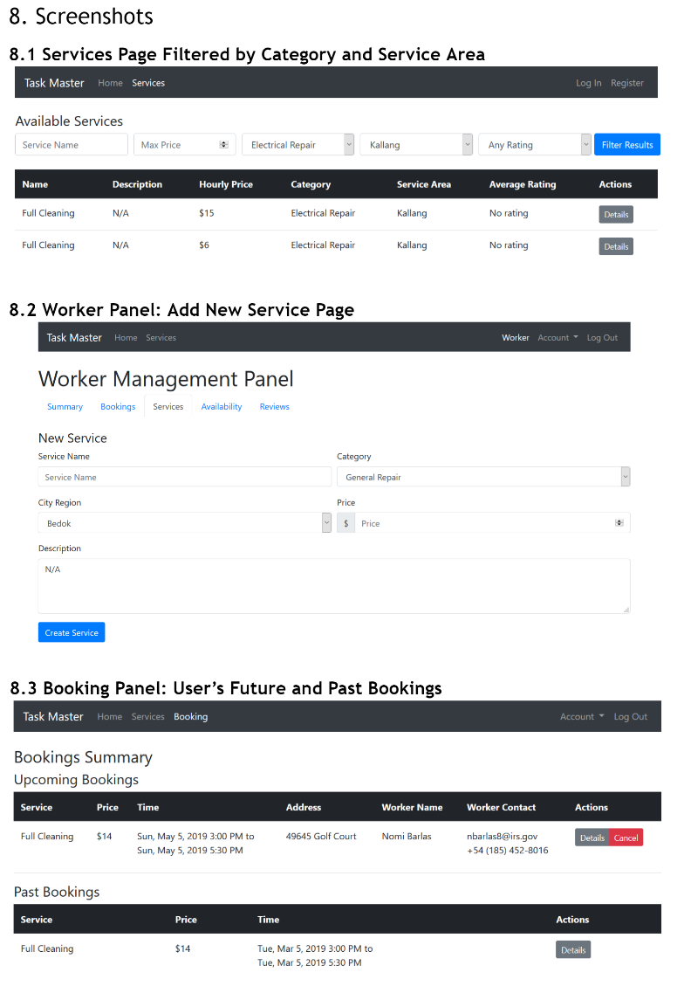

# Application Setup

### For the project report and developer information click [here](https://github.com/PhilipPhil/task-master-cs2102/blob/master/project%20report.pdf)

In order to setup the application, the steps for database setup need to be completed first, and in the exact order given. Then, the application environment setup needs to be completed, also in order.

The application can be run by using the `npm start` command from within the `App` folder.

# Database Setup

1. Create a new database for the application (e.g. `taskmaster`)
2. Make sure to set that as the active database before you run the scripts
3. Navigate into the `sql` folder
4. Execute the `create-tables.sql` script on your instance of the database
5. Execute the `seed-tables.sql` script on your instance of the database
6. Execute the `create-views.sql` script on your instance of the database
7. Execute the `create-triggers.sql` script on your instance of the database

# Environment Setup

1. Navigate into the `App` folder and run `npm install`
2. Make a copy of `template.env`, rename it to just `.env`
3. Adjust the password/database name in the `DATABASE_URL` to be correct
4. Set `SECRET` to be some random string of characters

# Screenshots

